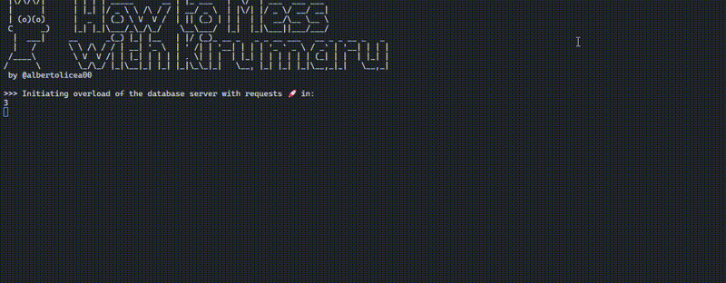

# How to Mess with Kirymaru 😈

magine Kirymaru, innocently sipping his coffee ☕, thinking he's got everything under control. Little does he know, behind the scenes, a mischievous script is at play. This code, aptly named "How to Mess with Kirymaru," is a delightful concoction of fake data generation and API bombardment. Using the magical powers of Faker.js, it fabricates names, publications, and academic endorsements faster than Kirymaru can say `error 404.` 🛠️

With each second that passes, this script launches a relentless onslaught of requests to:

- [Create Bibliography Endorsement](https://kirymaru.pythonanywhere.com/api/avales_biblio/ )
- [Create Publication Endorsement](https://kirymaru.pythonanywhere.com/api/profesores/)
- [Create Tutorship Endorsement](https://kirymaru.pythonanywhere.com/api/avales_tuto/)
  

Kirymaru's server may tremble, and his logs will blush with success and failure counts meticulously colorized in the terminal 📊. Remember, it's all in good fun—just a friendly prank to keep Kirymaru on his toes! 😉



## Pre-Requisites:
- Make sure you have Node.js and npm installed on your system.
- Ensure you have access to an internet connection.

Clone the repo
```batch
git clone https://github.com/albertolicea00/how-to-mess-with__Kirymaru.git
```

Go to the repo
```batch
cd how-to-mess-with__Kirymaru
```

Instal dependencies
```batch
npm i
```

## Running the Script
```
npm run hack
```
or
```
node app.js
```

## Stop the Script
```
Ctrl + C
```

## Configure (opcional)
You can configure how many requests per second to make in the .env file (`default: 1`). This means that every second, three creation requests are made to each of the following URLs:

- https://kirymaru.pythonanywhere.com/api/avales_biblio/
- https://kirymaru.pythonanywhere.com/api/profesores/
- https://kirymaru.pythonanywhere.com/api/avales_tuto/


Consider that increasing the number of requests per second raises the likelihood of encountering failures. Higher loads can strain the server and increase the probability of errors. Adjust the `ITERATIONS_X_SEC` variable in your `.env` file accordingly. A higher value can speed up task completion but may also increase the risk of server overload and potential failures.

After updating the `.env file`, remember to restart your application for the changes to take effect.


